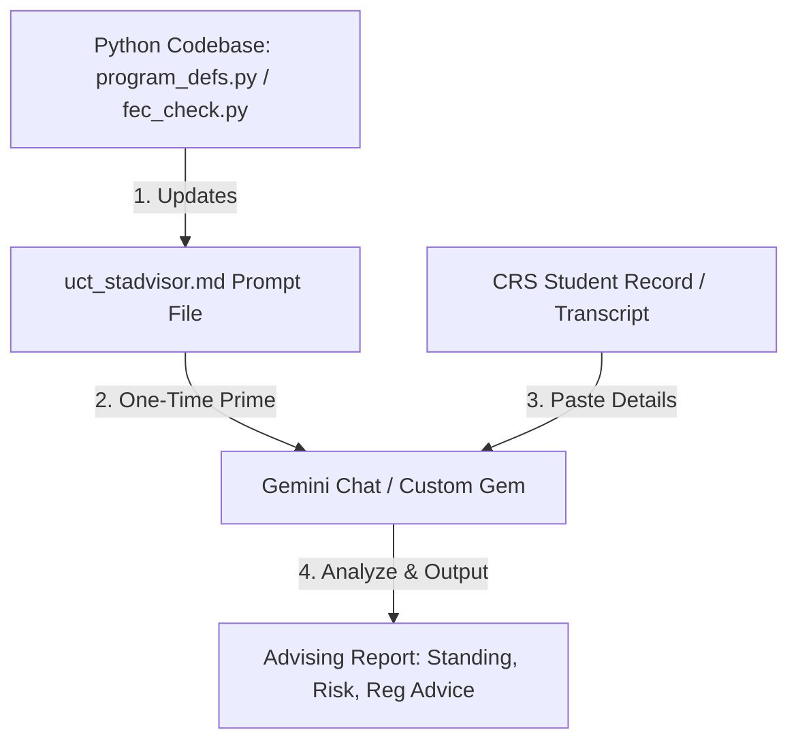

# UCT EEE AI-Assisted Student Advising: Workflow Guide

This guide outlines how EEE Student Advisors can use the UCT Gemini Sandbox to automate and enhance academic advising. By priming Gemini with the department's structured progression rules, advisors can quickly assess a student's academic standing, evaluate risks of exclusion, and get registration recommendations.

---

## 1. How the Workflow Works

Advisors interact with Gemini in a secure, UCT-approved workspace environment (by logging in with their `*.uct.ac.za` account). 

---

## 2. Step-by-Step Setup

Staff can use one of two methods in the Gemini interface (log in at [gemini.google.com](https://gemini.google.com) using your UCT credentials):

### Option A: Create a Custom "Gem" (Highly Recommended)
If your UCT Gemini subscription supports **Gems** (custom AI assistants), this is the easiest option because you only set it up once.
1. Open Gemini and click **Gems** or **Create Gem** in the sidebar.
2. Name the Gem: `EEE Student Advisor`.
3. In the **Instructions** box, copy and paste the entire contents of [uct_stadvisor.md](uct_stadvisor.md).
4. Click **Create** or **Save**.
5. Your EEE Advisor is now saved in your sidebar and ready for reuse in any new session.

### Option B: Direct Chat Priming (Fallback)
If Gems are not available, you can prime a normal chat session:
1. Start a new chat in Gemini.
2. Copy the entire contents of [uct_stadvisor.md](uct_stadvisor.md).
3. Paste the contents into the chat box as the very first message, prefixed with:
   > *"You are an EEE Student Advising AI. Please read and adopt the following system prompt and departmental rules. Reply 'System primed and ready' when you have ingested them."*
4. Keep this chat open for all student advising sessions during the day.

---

## 3. Daily Advising Workflow

Once your Gem or chat is primed, use this process to advise a student:

1. **Get the Student's History**: Copy the student's academic record or full transcript text from the Course Record System (CRS) or open Excel worksheets.
2. **Submit to Gemini**: Paste it into the chat with a simple instruction:
   > *"Analyze this student's record and provide: (1) Current Academic Standing, (2) Risk Assessment, (3) Registration recommendations for next semester."*
3. **Review the Output**: Gemini will calculate the total credits, check core and elective satisfaction, flag any N+1/N+2 exclusion risks, and recommend courses to register for.
4. **Draft Advisor Response**: Review and refine Gemini's output before conveying the final advice to the student.

---

## 4. Updates & Maintenance (For Developers)

To ensure the AI always uses the correct curriculum rules and course codes, developers must maintain alignment between the codebase and the prompt:

1. **Source of Truth**: The definitive rules are codified in:
   * [program_defs.py](program_defs.py): For core courses, electives, and course equivalencies.
   * [fec_check.py](fec_check.py): For credit thresholds, strikes, transfer student logic, and N+1/N+2 rules.
2. **Propagating Changes**:
   * When curriculum rules or course codes change, update the Python files first.
   * Mirror those exact modifications in the [uct_stadvisor.md](uct_stadvisor.md) prompt file.
3. **Staff Notifications**:
   * Commit the changes to the Git repository.
   * Advise staff members to **copy the updated contents** of `uct_stadvisor.md` and update their Custom Gem instructions or start a new primed chat session.
